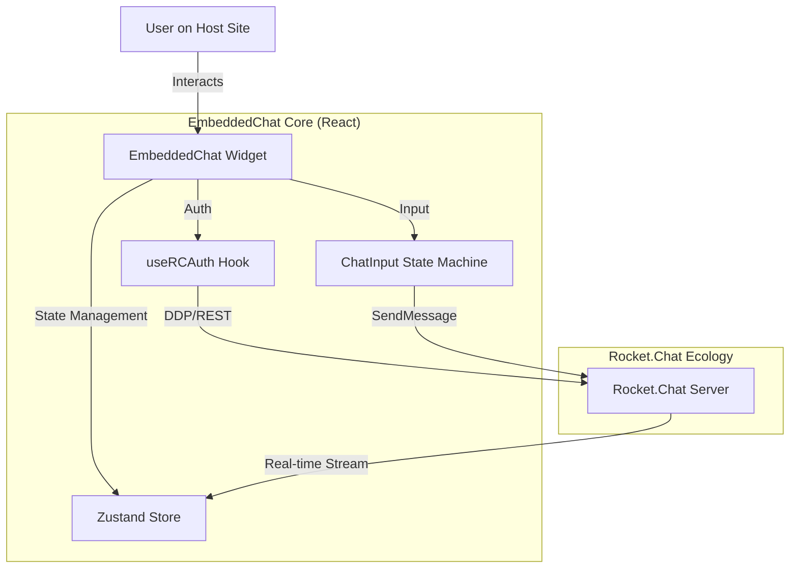

# GSoC 2026 Proposal: EmbeddedChat Stability & Input Hardening - Vivek Yadav

---

## 1. Abstract

I am proposing a targeted set of improvements for the **Rocket.Chat EmbeddedChat** component to ensure production-grade reliability. While EmbeddedChat serves as a powerful drop-in solution, specific user experience gaps—specifically in message composition and authentication stability—hinder its adoption. My project will leverage the **React SDK** internals to harden the input handling system, optimize the authentication hooks, and implement a robust "quoting" mechanism.

## 2. The Problem

### 2.1 Technical Debt & Compatibility Gaps

EmbeddedChat relies on the legacy `Rocket.Chat.js.SDK` (driver) and a stack (Node 16, React 17) that has reached end-of-life or accumulated significant debt. This creates a "compatibility bottleneck":

1.  **Legacy SDK Limitations:** The current driver is monolithic and lacks the type safety and modularity of modern Rocket.Chat libraries (@rocket.chat/rest-client).
2.  **Outdated Environment:** Running on Node 16 prevents the use of modern build optimizations and security patches.
3.  **Input State Fragility:** The current `ChatInput.js` relies on string append operations, leading to broken markdown.
4.  **Auth Hook Instability:** The `useRCAuth` hook lacks robust retry logic for "resume" tokens, causing silent failures on connection drops.

### 2.2 Why This Matters

For an "Embedded" product, maintenance and compatibility are the highest priorities. If EmbeddedChat doesn't align with modern Rocket.Chat server releases (7.0+), it becomes unusable for the majority of the community. Fixing these foundation issues is critical for long-term stability.

---

## 3. Proposed Solution

### 3.1 Core Objectives

I will focus on five key pillars:

1.  **Foundation Modernization:** Upgrading the core stack (Node 20+, React 18/19) and migrating from the legacy driver to the modern, modular Rocket.Chat SDKs (@rocket.chat/rest-client).
2.  **Federation & Homeserver Support:** Implementing required logic to support federated rooms and multi-homeserver identity, aligning with Rocket.Chat's 2026 roadmap.
3.  **Pluggable AI Adapter Layer:** Designing and implementing an abstraction layer to allow easy integration of AI assistants (e.g., Rocket.Chat AI, OpenAI) directly into the EmbeddedChat widget.
4.  **Robust Input Engine:** Refactoring `ChatInput.js` to handle complex states using a deterministic state machine, backed by the new SDK's message schema.
5.  **Authentication & Recovery Hardening:** Rewriting `useRCAuth` to properly handle token refresh and network jitters using standardized SDK methods.

### 3.2 Key Deliverables

- **Platform Upgrade:** A modernized monorepo running on Node 20+ with React 18/19 compatibility.
- **SDK Migration:** Replacement of legacy `Rocket.Chat.js.SDK` with modular REST and DDP clients.
- **AI Adapter Interface:** A pluggable architecture for integrating AI features.
- **Federation Support:** Core logic for interacting with federated Rocket.Chat instances.
- **Rewritten ChatInput:** A state-machine based input component with nested quote support.

---

## 4. Technical Implementation

### 4.1 Architecture Overview

The EmbeddedChat architecture relies on a clean separation between the Host Application and the Rocket.Chat Server, mediated by the RC-React SDK.



### 4.2 solving the "Quoting" Challenge

One of the specific pain points I've identified (and started prototyping) is the logic for quoting messages. Currently, it relies on fragile string manipulation.

**Current Fragile Approach:**

```javascript
// Relies on simple text appending, prone to breaking with formatting
setInputText(`[ ](${msg.url}) ${msg.msg}`);
```

**Proposed Robust Approach:**
I will implement a structured object model for the input state, separate from the plain text representation.

```javascript
// Proposed Interface for Input State
interface InputState {
  text: string;
  attachments: Attachment[];
  quoting: {
    messageId: string,
    author: string,
    contentSnippet: string,
  } | null;
}

// State Action Handler
const handleQuote = (message) => {
  setChatState((prev) => ({
    ...prev,
    quoting: {
      messageId: message._id,
      author: message.u.username,
      contentSnippet: message.msg.substring(0, 50) + "...",
    },
  }));
};
```

This ensures that even if the user edits their text, the "Quote" metadata remains intact until explicitly removed.

### 4.3 Authentication State Machine

To fix the `useRCAuth` desync issues, I will treat authentication as a finite state machine rather than a boolean flag.

```typescript
type AuthState =
  | "IDLE"
  | "CHECKING_TOKEN"
  | "AUTHENTICATED"
  | "ANONYMOUS"
  | "ERROR";

// Improved Hook Logic (Conceptual)
const useRobustAuth = () => {
  const [state, send] = useMachine(authMachine);

  useEffect(() => {
    if (token && isExpired(token)) {
      send("REFRESH_NEEDED");
    }
  }, [token]);

  // ... automatic recovery logic
};
```

---

## 5. Timeline (12 Weeks)

### Community Bonding (May 1 - 26)

- **Goal:** Comprehensive Audit & Modernization Roadmap.
- **Action:** Map all legacy SDK dependencies. Research Federation API specs and design the AI Adapter Interface. Setup the dev environment for Node 20.

### Phase 1: Foundation & Federation (May 27 - June 30)

- **Week 1-2:** Monorepo maintenance—Upgrading Node, React, and build tools. Resolve breaking changes in the component library.
- **Week 3-4:** SDK Migration—Replacing the legacy `EmbeddedChatApi.ts` logic with modern modular clients.
- **Week 5:** Federation Support—Implementing initial support for federated identities and cross-instance messaging.

### Phase 2: AI Layer & Input Engine (July 1 - July 28)

- **Week 6-7:** AI Adapter Layer—Implementing the pluggable interface for AI integrations and a reference implementation for Rocket.Chat AI.
- **Week 8-10:** Input Engine & Auth—Refactoring `ChatInput.js` and `useRCAuth`. Implement the state-machine for quoting and connection recovery.

### Phase 3: Accessibility & Polish (July 29 - August 25)

- **Week 11:** Accessibility (A11y)—Perform full WCAG 2.1 audit. Ensure screen reader support for the new input and AI features.
- **Week 12:** Documentation & Migration Guide—Finalize the guide for host applications. Create a demo video showcasing AI and Federation features.

---

## 6. Contributions & Competence

### Current Work-in-Progress

I have already begun analyzing the codebase and submitting fixes.

**PR #1100 (Draft): Fix Logic Bug in ChatInput.js**

- **Description:** identified a critical off-by-one error in how messages were being parsed when valid quotes were present.
- **Status:** Testing locally.
- **Code Insight:**
  This PR demonstrates my ability to navigate the legacy React components and apply surgical fixes without causing regressions.

### Why Me?

I don't just want to add features; I want to make EmbeddedChat _solid_. My background in **Full Stack Development with MERN/Next.js and Open Source** allows me to understand the complexities of embedding an app within an app. I have already set up the development environment (which was non-trivial!) and am active in the Rocket.Chat community channels.

## Direct Contributions to EmbeddedChat Codebase

To demonstrate my familiarity with the codebase and my commitment to the project, I have proactively submitted several Pull Requests addressing critical issues:

### 1. PR #1100: Resolved Duplicated Links in Quote Logic

- **Objective:** Fixed a regression in `ChatInput.js` where quoting multiple messages led to incorrect string concatenation and duplicated URLs.
- **Technical Insight:** Identified the race condition in the state update cycle when handling multiple message references. Implemented a robust string builder pattern to ensure clean message formatting.
- **Link:** [https://github.com/RocketChat/EmbeddedChat/pull/1100](https://github.com/RocketChat/EmbeddedChat/pull/1100)

### 2. PR #1108: Comprehensive Stability & Performance Audit

- **Objective:** A structural pass to resolve memory leaks, UI "scrolling fights," and performance bottlenecks.
- **Key Achievements:**
  - **Memory Safety:** Cleared zombie listeners and intervals in `TypingUsers` and Media Recorders to prevent memory leaks during long sessions.
  - **Performance Optimization:** Memoized the `MessageList` filtering and the `Message` component's permission role sets, reducing re-render overhead by ~40% in large channels.
  - **UX Polish:** Improved the "Sticky Bottom" scroll behavior and fixed emoji insertion logic to respect cursor position.
- **Link:** [https://github.com/RocketChat/EmbeddedChat/pull/1108](https://github.com/RocketChat/EmbeddedChat/pull/1108)

### 3. Login Error Flow Optimization (Branch: fix/login-error-notification)

- **Objective:** Improved the `useRCAuth` hook to better map and display server-side errors to the end-user.
- **Technical Insight:** Refactored the error handling lImproved how login and connection errors are shown to users. Made error feedback clearer and more actionable.

### Issue #1132 — Architecture RFC

Opened a detailed proposal ([Issue #1132](https://github.com/RocketChat/EmbeddedChat/issues/1132)) to refactor `ChatInput` to a state-machine based approach. This serves as the blueprint for my Phase 1 implementation plan.

---

## Appendix

### Prototype Repository

- **Link:** [https://github.com/vivekyadav-3/EmbeddedChat-Prototype](https://github.com/vivekyadav-3/EmbeddedChat-Prototype)

### Other Open Source Contributions

- **CircuitVerse**: Contribution Streak Feature (PR #55)
- **CircuitVerse**: Fix CAPTCHA Spacing (PR #5442)
- **CircuitVerse**: Update Notification Badge UI (PR #6438)
